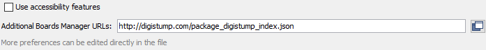
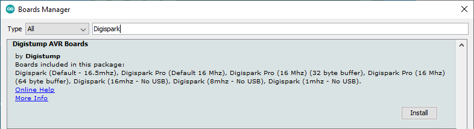
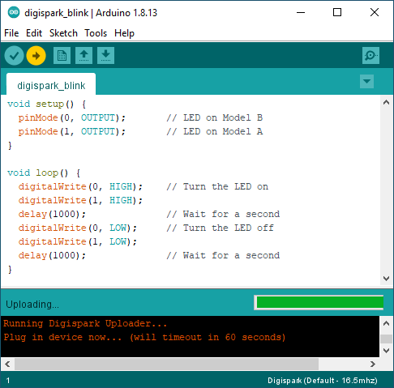

# 1. Install the Arduino IDE
Go to the Arduino website then [download and install the Arduino IDE](https://www.arduino.cc/en/software).

# 2. Install the Digispark Board Support Package
## Open Preferences Dialog box
From the top menu of the Arduino IDE application, select File → Preferences to open the Preferences dialog box.

Paste the following in the Additional Boards Manager URLs: box of the Preferences dialog box.
https://raw.githubusercontent.com/ArminJo/DigistumpArduino/master/package_digistump_index.json



## Open Boards Manager Dialog Box
In the Arduino IDE, use the top menu to navigate to Tools → Board → Boards Manager... to open the Boards Manager dialog box.

Type Digispark into the search field at the top of the Boards Manager dialog box that contains the text "Filter your search..." to easily find the Digispark package.

Find and install Digistump AVR Boards.



When installation completes, click the Close button at the bottom right of the dialog box.

# 3. Add udev Rules to the System
To be able to program the Digispark board from the Arduino IDE in Linux, udev rules must be added to the system. This is done by creating a file in /etc/udev/rules.d/ that contains the rules.

Create a text file called 49-micronucleus.rules in /etc/udev/rules.d/ and add the following rules to it.

To do so: `sudo nano /etc/udev/rules.d/49-micronucleus.rules`

Then copy and paste this:
```
# UDEV Rules for Micronucleus boards including the Digispark.
# This file must be placed at:
#
# /etc/udev/rules.d/49-micronucleus.rules    (preferred location)
#   or
# /lib/udev/rules.d/49-micronucleus.rules    (req'd on some broken systems)
#
# After this file is copied, physically unplug and reconnect the board.
#
SUBSYSTEMS=="usb", ATTRS{idVendor}=="16d0", ATTRS{idProduct}=="0753", MODE:="0666"
KERNEL=="ttyACM*", ATTRS{idVendor}=="16d0", ATTRS{idProduct}=="0753", MODE:="0666", ENV{ID_MM_DEVICE_IGNORE}="1"
#
# If you share your linux system with other users, or just don't like the
# idea of write permission for everybody, you can replace MODE:="0666" with
# OWNER:="yourusername" to create the device owned by you, or with
# GROUP:="somegroupname" and mange access using standard unix groups.
```

Finally enter the following in the terminal window to reload the udev rules.

`sudo udevadm control --reload-rules`

# 4. Testing the Digispark Linux Mint Installation
The board must not be plugged into a USB port, but must first be selected in the Arduino IDE. No port is selected. The sketch is uploaded, and when a prompt appears in the Arduino IDE, the board is plugged into a USB port.

## Digispark Blink Sketch
```
void setup() {                
  pinMode(0, OUTPUT);      // LED on Model B
  pinMode(1, OUTPUT);      // LED on Model A   
}

void loop() {
  digitalWrite(0, HIGH);   // Turn the LED on
  digitalWrite(1, HIGH);
  delay(1000);             // Wait for a second
  digitalWrite(0, LOW);    // Turn the LED off
  digitalWrite(1, LOW); 
  delay(1000);             // Wait for a second
}
```

## Select the Digispark Board in the Arduino IDE
From the top menu in the Arduino IDE, select Tools → Board → Digistump AVR Boards → Digispark (Default - 16.5MHz) to select the Digispark board.

## Load the Blink Sketch to the Digispark Board
Click the Arduino Upload button on the top toolbar before plugging the Digispark board into a USB port.



When the prompt Plug in device now... (will timeout in 60 seconds) appears, plug the Digispark board into a USB port of the computer.

After the sketch finishes uploading, a success message running: 100% complete and >> Micronucleus done. Thank you!
