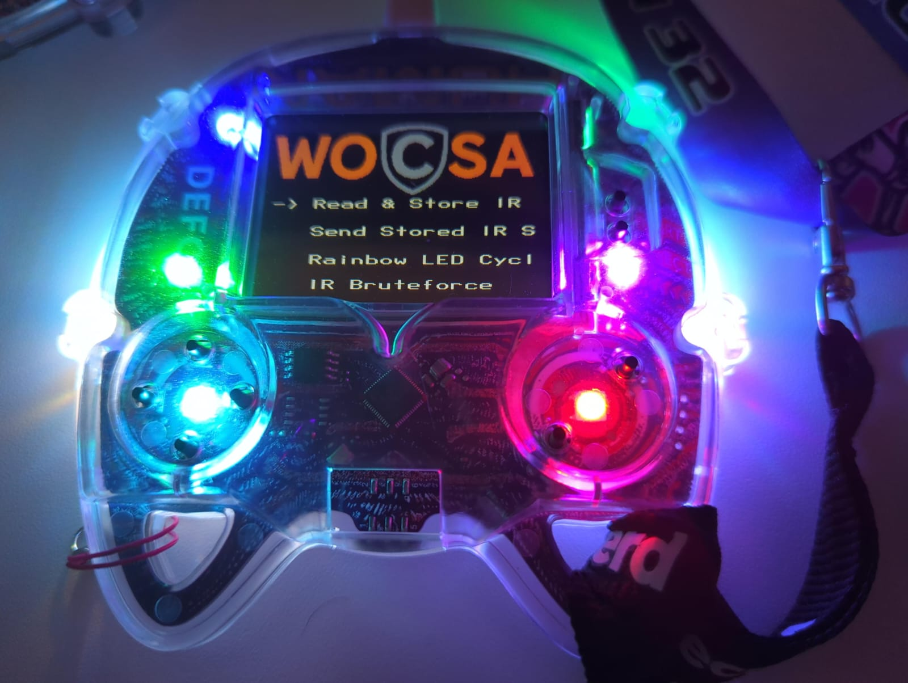
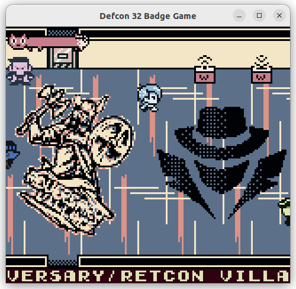

# Warning
This workshop is for educational purposes only.
Ethical hacking is conducted with the explicit permission of the system owner to improve security.

** Do this workshop with a Linux system installed directly on the computer might be easier than with MS Windows or with a virtual machine **




# DEFCON 32 Badge Workshop
This workshop use the [DEFCON 32 Badge](https://www.tomshardware.com/raspberry-pi/raspberry-pi-pico/raspberry-pi-pico-2-developer-demonstrates-running-doom-on-rp2350-powered-def-con-32-badge)  as hardware material.


To discuss about this workshop you can join our [WOCSA discord](https://discord.gg/P2YH3ubC) in ETHICAL HACKING WORKSHOPS category.


The goal of the workshop is to be able to record and replay or forge IR UART packet to add items in remote DEFCON32 Badge ROM Inventory.
There is 12 slots in the inventory of the DEFCON32 ROM.


This workshop has 4 levels of difficulty:
1) Discovery
   a) fix bugs of the initial version of the badge (game saving error, ir emitter/receiver issue)
   b) flash with the rickrool firmware special feature menu to send rickroll music to other badges.
2) Mimic the badge IR communication
   a) Develop a micropython software able to record IR message from standard badge FIRMWARE+DEFCON32 ROM
   b) Develop a micropython software able to forge or replay IR messages to the standard badge FIRMWARE+DEFCON32 ROM
3) Update the DEFON32 ROM
   a) add in adversary village room a WOCSA button to read UART IR message and store the message in a variable
   b) add in adversary village room a WOCSA button to send stored to IR Remote badge
4) Extend DEFCON32 FIRMWARE capabilities with SOA I2C capabilities using register command 13 and 14 copy IR calls to replace with I2C calls

## Related links
[Badge Creator project description by Mar Williams](https://marwilliams.art/blogs/projects/def-con-32-badges)
[Official DEFCON32 Badge Repository](https://media.defcon.org/DEF%20CON%2032/DEF%20CON%2032%20badge/)
[Firmware Creator project description by DimitryGr](https://dmitry.gr/?r=06.+Thoughts&proj=11.+RP2350#_TOC_938ebfd37c7b6cb6656c4bcb87fca874)
[GB interface to badge extra features by DimitryGr](https://docs.google.com/document/d/1COY5n0HhBcBq7ILwsKtOjV-_0-arNPkk_qBH9PI9fms/edit#heading=h.gldd1ycy1odt)
[Badge Writeup by Dietcholoatebar](https://docs.google.com/document/d/1Jff1UbKaRGoHoAug1c0r6a4Y-MYruvgVORGG8c63sNQ/edit#heading=h.38ffvio0tkya)
[RP2350 Hacking Challenge](https://github.com/raspberrypi/rp2350_hacking_challenge)
[Raspberry PICO Official doc](https://datasheets.raspberrypi.com/pico/getting-started-with-pico.pdf)

### Firmware (including bare-metal Emulator uGB)
[Creator's Firmware Source Code 1.5 by DimitryGr](http://dmitry.gr/images/defcon_code_1.5.0.tar.bz2)
[Creator's Firmware Binary 1.5 by DmitryGr](http://dmitry.gr/images/defcon_update_1.5.0.tar.bz2)
[Creator's Firmware Binary and UF2 1.6 by DmitryGr](https://discord.com/channels/867438418212683796/1262488625799495732/1271971778985590805)
[Unofficial Repository of Firmwares by Jaku](https://github.com/jaku/DEFCON-32-BadgeFirmware)
[Firmware generator by Jaku](https://defrom.lol/)
[Custom firmware using all LEDs by Calvin-LL](https://github.com/Calvin-LL/defcon-32-badge-flashy-rom)
[Raspberry PICO SDK Header for the DEFCON32 Badge](https://github.com/raspberrypi/pico-sdk/blob/master/src/boards/include/boards/defcon32_badge.h)

### Alternative Operating System
[Creator's rePalm Operating System](https://dmitry.gr/?r=05.Projects&proj=27.%20rePalm#_TOC_0734fd58b98b17e23027547eec1258f5)

### Micropython firmware
[Micropython tutorial from p0ns](https://github.com/p0ns/micropython-dc32)


### SD Card
[Unofficial SD Card files repository by BillyBriant](https://github.com/billyjbryant/DC32-Badge-Hack/tree/main/DC32BadgeSD)

### Gameboy Color ROMs
[DEFCON 32 Official Game ROM by CosmicBonBon](https://github.com/CosmicBonBon/DC32BadgeGame)
[Game Development IDE used for the Official ROM](https://github.com/chrismaltby/gb-studio/)
[Windows Bluescreen ROM](https://github.com/rootabeta/BSoDEFCON/tree/main)

## Level 1: Discovery
### SD Card issue
#### FAT filesystem corruption
The FAT system contains error in the SD Card.
But the SD Card could by physically damaged too.

1. Get a new SD card. The con ones are cheap garbage. (NOTE: If you are using the con SD card, use firmware 1.5. Otherwise go for 1.4 linked below)
2. Format using the SD Formatter from the sdcard.org website
3. Delete any existing partition using diskmgmt
4. Do not use "fast formatting" when creating a new partition
5. It might've helped to start with a 2GB FAT16 partition first, but now I've expanded to a 4GB FAT32 partition
6. I did all this on Windows, using the g firmware
7. Make sure to put your roms in the ROM folder
[source](https://discord.com/channels/867438418212683796/1262488625799495732/1271261374537797798)

Note: disk copy from original SD Card is possible using ddrescue

#### Game Save issue
1. Create a new folder on the root of the SD card named "SAVE"
2. Install firmware 1.5 (But the game crash when you take the stairs)
[source](https://discord.com/channels/867438418212683796/1262488625799495732/1271261374537797798)

3. copy original ROM on SD CARD then load it to have ROM without bug

#### Filenames unsupported 
Only FAT filename are supported even on FAT32 filesystem.
Use tool to rename filenames and sanitize them like detox.

### FIRMWARE Upgrade
Badge must be powered off prior to start.
1. Maintain pressed Boot button then plug the computer with USB C cable
2. Continue to maintain the Boot button then press shortly Reset button
3. A new usb storage appear named RP2350 on the computer
4. Upload the firmware you want with the name FIRMWARE.uf2 then wait badge to reboot (usb storage must disappear and re-appear)
5. Press Reset button and wait

## Level 2: Mimic the standard IR messages

1. Build the micropython firmware from [source code fork for rp2 rp2350 by dpgeorge](https://github.com/dpgeorge/micropython/tree/rp2-add-rp2350)  with the [LCD Driver ST7789](https://github.com/russhughes/st7789_mpy)
2. flash the micropython firmware
3. install Thonny IDE ```pip install thonny```
4. plug the Badge in USB C with the Computer in Thonny IDE configure run environment on the Badge
   a) Configure Interpret: Menu Run => Configure Interpreter => Interpreter kind: Micropython (Raspberry Pi Pico) => Port or WebREPL: Try to detect port automatically => OK
   b) Show file view at the left: View => Files
5. write a main.py file with PIN related to HW wiring (from creator firmware source code or from the hardware schematic pdf)
6. Analyse IR protocol from DEFCON32 ROM source code with GBStudio then from the FIRMWARE 1.5.0 source code
7. Write a simple IR receiver code and send inventory item from a standard FRIMWARE+ROM Badge to your code
8. Write a simple IR emitter to send the same messafe to a standard FRIMWARE+ROM Badge
9. Write a simple menu on the display to use IR reception function then store the message and send it using the IR emitter function

## Level 3: Upgrade the official DEFCON32 ROM with WOCSA IR mimic buttons
1. Open the official DEFCON32 ROM with GBStudio
2. Create a WOCSA sprite button to receive IR message and store it in a variable and add this sprite with a trigger in the Adversarial Village Room
3. Modify the IR Reception Scene to be able to use it with the WOCSA IR Receiver Button
4. Create a WOCSA sprite button to send IR stored message to remote Badge
5. Modify the IR Emitter Scene to be able to use it with the WOCSA IR Emitter button


