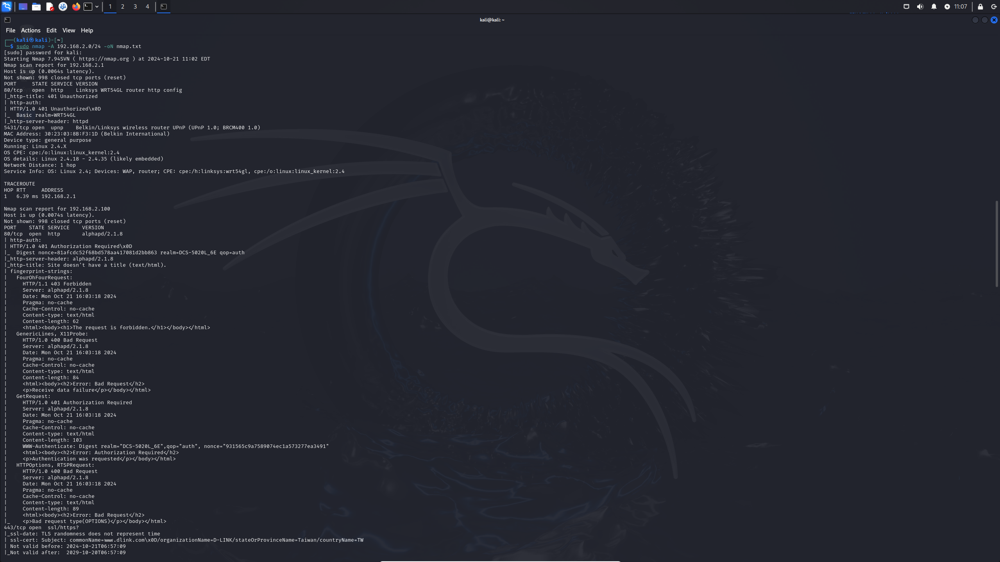
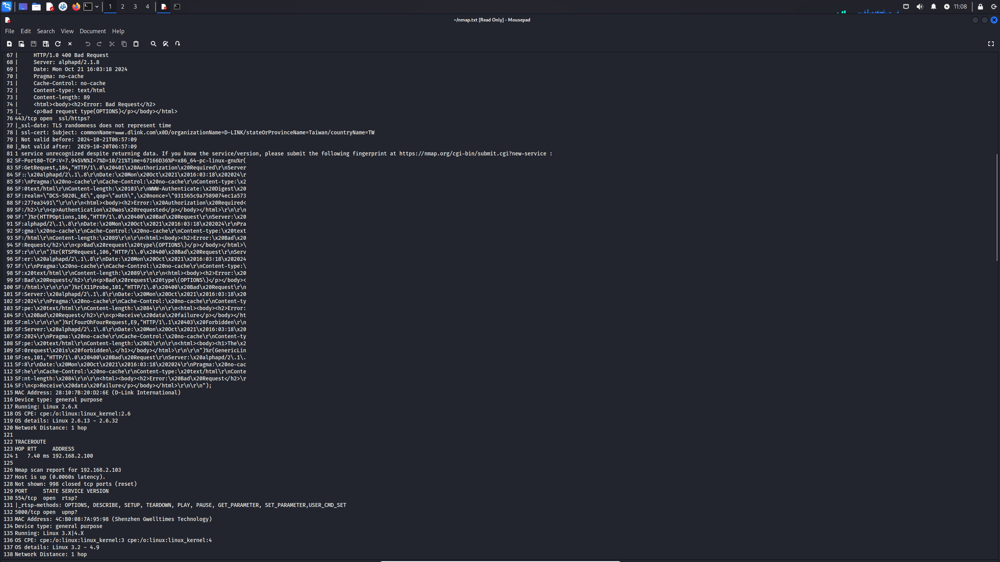
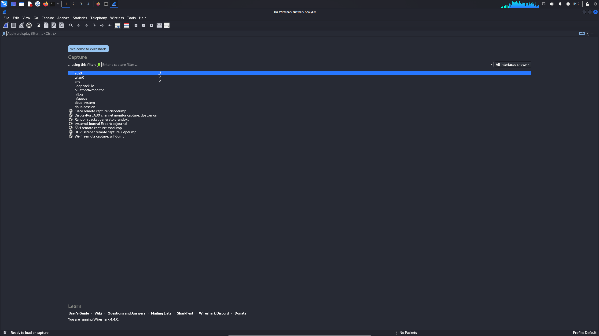
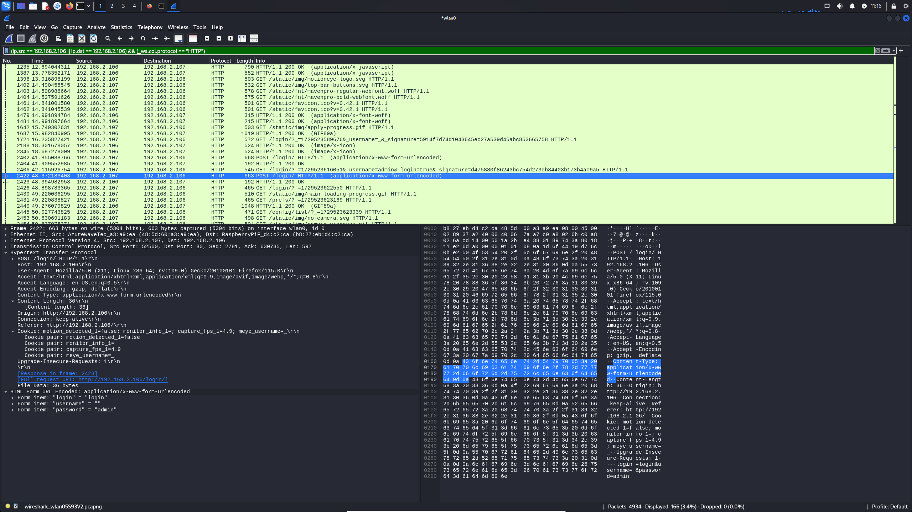
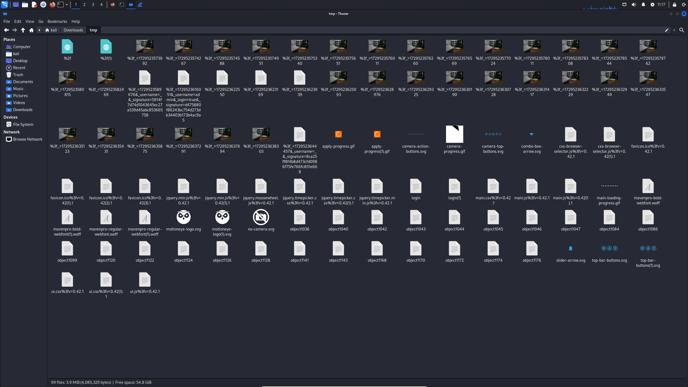
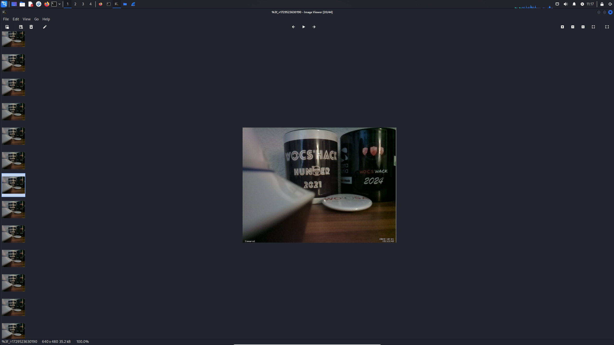

# Warning
This workshop is for educational purposes only.
Ethical hacking is conducted with the explicit permission of the system owner to improve security.

# Table of Contents

- [Warning](#warning)
- [Table of Contents](#table-of-contents)
- [Introduction to IP Cameras](#introduction-to-ip-cameras)
  - [What is an IP Camera?](#what-is-an-ip-camera)
  - [How Do IP Cameras Work?](#how-do-ip-cameras-work)
    - [1. **Image Capture**](#1-image-capture)
    - [2. **Video Compression**](#2-video-compression)
    - [3. **Network Transmission**](#3-network-transmission)
    - [4. **Remote Access**](#4-remote-access)
    - [5. **Recording and Storage**](#5-recording-and-storage)
  - [Types of IP Cameras](#types-of-ip-cameras)
  - [Vulnerabilities of IP Cameras](#vulnerabilities-of-ip-cameras)
    - [1. **Default Credentials**](#1-default-credentials)
    - [2. **Unencrypted Data Transmission**](#2-unencrypted-data-transmission)
    - [3. **Firmware Vulnerabilities**](#3-firmware-vulnerabilities)
    - [4. **Insecure Web Interfaces**](#4-insecure-web-interfaces)
    - [5. **Weak or No Encryption**](#5-weak-or-no-encryption)
    - [6. **Remote Access Exploits**](#6-remote-access-exploits)
    - [7. **Botnet Recruitment**](#7-botnet-recruitment)
  - [How to Mitigate These Risks](#how-to-mitigate-these-risks)
  - [Benefits of IP Cameras](#benefits-of-ip-cameras)
- [Workshop](#workshop)
  - [IP Cameras over HTTP](#ip-cameras-over-http)
  - [Scan the Network](#scan-the-network)
  - [Connect to the IP Camera](#connect-to-the-ip-camera)
  - [Capture Unencrypted Information Using Wireshark](#capture-unencrypted-information-using-wireshark)

# Introduction to IP Cameras

## What is an IP Camera?

An **IP camera** (Internet Protocol camera) is a type of digital video camera that sends and receives data over a network or the internet. Unlike analog closed-circuit television (CCTV) cameras, which require a direct connection to a recording device (DVR), IP cameras can transmit video footage over local networks, Wi-Fi, or even remotely via the internet.

## How Do IP Cameras Work?

IP cameras work by capturing video footage and converting it into a digital signal. This digital data is then transmitted over a network for viewing, recording, or remote access. Here are the key steps in how they function:

### 1. **Image Capture**
IP cameras use a digital image sensor to capture video. This image sensor converts light into electrical signals, which are processed to form digital video data.

### 2. **Video Compression**
To save bandwidth and storage, the raw video is compressed using various codecs (like H.264, H.265, or MJPEG). This reduces the file size while maintaining video quality.

### 3. **Network Transmission**
The compressed video stream is sent over the network using standard IP protocols. The camera is assigned an IP address, which allows devices on the same network (or over the internet) to access the video stream.

### 4. **Remote Access**
IP cameras can be accessed remotely, meaning users can view the footage from anywhere in the world via a browser or dedicated app. This is typically secured using encryption or authentication mechanisms.

### 5. **Recording and Storage**
Footage from IP cameras can be stored on local devices, like a Network Video Recorder (NVR), or on cloud-based storage services. Some IP cameras also support local storage via SD cards.

## Types of IP Cameras

1. **Wired IP Cameras**: These cameras connect to a network using Ethernet cables. They typically offer stable, high-quality video without relying on wireless signals.
   
2. **Wireless IP Cameras**: These cameras connect to the network via Wi-Fi, offering more flexibility in placement but may be prone to signal interference.

## Vulnerabilities of IP Cameras

While IP cameras offer numerous benefits, they are also susceptible to various security vulnerabilities. Below are some of the most common risks associated with IP cameras:

### 1. **Default Credentials**
Many IP cameras are shipped with default usernames and passwords, like "admin" and "password." If these are not changed during setup, attackers can easily gain access to the camera’s feed.

### 2. **Unencrypted Data Transmission**
Some older or poorly configured IP cameras transmit data, including video streams, over unencrypted channels. This means that if someone intercepts the network traffic, they can view the footage in plain text.

### 3. **Firmware Vulnerabilities**
Like all network-connected devices, IP cameras have software (firmware) that can contain bugs or security flaws. If these vulnerabilities are not patched through firmware updates, they can be exploited by attackers to take control of the device.

### 4. **Insecure Web Interfaces**
Many IP cameras come with web-based interfaces that allow users to control settings remotely. If these interfaces are poorly designed or not updated, they can be vulnerable to cross-site scripting (XSS), cross-site request forgery (CSRF), or SQL injection attacks.

### 5. **Weak or No Encryption**
Cameras that don’t use strong encryption protocols for data transmission can be vulnerable to man-in-the-middle (MITM) attacks. This allows attackers to intercept, manipulate, or view the video feed without detection.

### 6. **Remote Access Exploits**
IP cameras that are exposed to the internet without proper protection (like firewalls or VPNs) are prime targets for hackers. Attackers can scan the internet for vulnerable cameras and exploit them to gain unauthorized access.

### 7. **Botnet Recruitment**
In some cases, compromised IP cameras can be recruited into a botnet. This is when multiple infected devices are used in coordinated cyberattacks like Distributed Denial of Service (DDoS) attacks. Examples include the Mirai botnet, which targeted insecure IoT devices, including IP cameras.

## How to Mitigate These Risks

1. **Change Default Credentials**: Always change default usernames and passwords when setting up the camera.
2. **Keep Firmware Up to Date**: Regularly check for and install firmware updates to patch security vulnerabilities.
3. **Enable Encryption**: Use encrypted protocols like HTTPS or SSL/TLS to secure data transmissions.
4. **Limit Remote Access**: Use firewalls, VPNs, or disable remote access features if not needed.
5. **Monitor Network Traffic**: Regularly check for unusual traffic to detect potential security breaches.

## Benefits of IP Cameras

- **Remote Viewing**: Access live footage from anywhere in the world.
- **High-Resolution Video**: IP cameras generally offer better video quality compared to analog cameras.
- **Scalability**: IP systems can easily add more cameras without complex wiring.
- **Integration**: They can integrate with other network-based systems, such as alarm systems and access controls.

# Workshop

## IP Cameras over HTTP
IP cameras over HTTP transmit video streams and data using the Hypertext Transfer Protocol, allowing users to access live footage and control settings via web browsers. While this makes remote monitoring convenient, transmitting video over HTTP without encryption (like HTTPS) can expose the feed to interception by attackers. Unsecured HTTP connections can lead to sensitive information being leaked or manipulated, making it crucial to enable HTTPS for encrypted communication and to apply authentication mechanisms to protect the IP camera from unauthorized access.

## Scan the Network

To identify active devices on your network, use the `nmap` tool:

1. **Basic Scan**: 
   Run the following command to scan the entire subnetwork (replace `<subnetwork>` with your own):
   ```bash
   nmap <subnetwork>
   ```
   Example for scanning a specific subnet:
   ```bash
   nmap 192.168.2.0/24
   ```
    <p style="text-align:center;">
        
    </p>

2. **Full Scan with OS and Service Detection**:
   To gather detailed information about the devices, including operating systems and services, run a more advanced scan and save the results to a file:
   ```bash
   nmap -A 192.168.2.0/24 -oN nmap.txt
   ```
   - `-A`: Enables OS detection, version detection, script scanning, and traceroute.
   - `-oN nmap.txt`: Saves the output in normal format to the `nmap.txt` file.
    
    <p style="text-align:center;">
        
    </p>

    <p style="text-align:center;">
        
    </p>

## Connect to the IP Camera

Once you've identified the IP address of the camera from the scan, follow these steps to connect:

1. **Open a Web Browser**:
   Use a web browser like Firefox or Chrome.
   
2. **Access the Camera's Web Interface**:
   In the address bar, enter the IP address of the camera, replacing `<ip>` with the actual IP address:
   ```
   http://<ip>/
   ```
   Example:
   ```
   http://192.168.2.10/
   ```
    <p style="text-align:center;">
        
    </p>

3. **Login**:  
   You may need credentials to access the camera. If the login page appears, enter the username and password provided for the camera. If you don't know the credentials, proceed with packet capturing in the next step.

    <p style="text-align:center;">
        
    </p>

## Capture Unencrypted Information Using Wireshark

To analyze the communication between your machine and the IP camera, you can use Wireshark to capture unencrypted traffic (such as HTTP).

1. **Open Wireshark**:
   Launch Wireshark and select the network interface that is connected to the same network as the camera.
    <p style="text-align:center;">
        
    </p>

2. **Start Capturing Traffic**:
   Begin capturing packets by clicking the **Start** button. Look for HTTP traffic, as this is typically unencrypted.

3. **Filter for HTTP Traffic**:
   Use a filter to narrow down the captured traffic to only HTTP:
   ```
   http
   ```
   This will help you focus on the unencrypted communication between your device and the IP camera.

4. **Identify Credentials**:
   Look through the HTTP traffic for any login attempts. Unencrypted credentials (such as username and password) might be visible in the request headers or payloads. You can follow the HTTP stream to see the full conversation.
    <p style="text-align:center;">
        
    </p>

5. **Extract HTTP Objects**:
   You can also extract files and images that were transmitted unencrypted:
   - Go to **File** > **Export Objects** > **HTTP**.
   - Browse through the list of HTTP objects (images, videos, etc.) and select the files you want to extract.
   - Save the files locally for further analysis.

    <p style="text-align:center;">
        
    </p>
    <p style="text-align:center;">
        
    </p>
    <p style="text-align:center;">
        
    </p>
