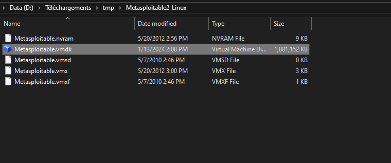
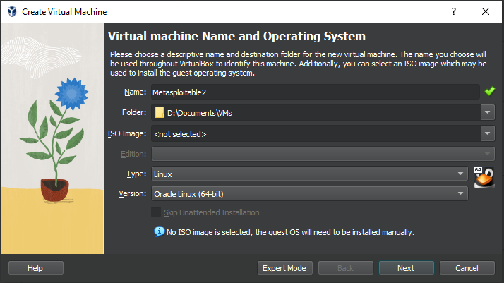

# Warning
This workshop is for educational purposes only.
Ethical hacking is conducted with the explicit permission of the system owner to improve security.

# Table of Contents

- [Warning](#warning)
- [Table of Contents](#table-of-contents)
- [Introduction](#introduction)
  - [What is Nmap?](#what-is-nmap)
  - [Why learn Nmap?](#why-learn-nmap)
  - [Basic Nmap options](#basic-nmap-options)
  - [Basic scan types](#basic-scan-types)
  - [Basic target specification](#basic-target-specification)
  - [More usefull options](#more-usefull-options)
  - [Nmap syntax](#nmap-syntax)
- [Workshop](#workshop)
  - [Install Nmap](#install-nmap)
  - [Deploy the vulnerable target](#deploy-the-vulnerable-target)
  - [Scan the target](#scan-the-target)
    - [Get the open ports](#get-the-open-ports)
    - [Get the services](#get-the-services)
    - [Get the OS](#get-the-os)
  - [Defense](#defense)
- [Conclusion](#conclusion)
- [References](#references)

# Introduction

## What is Nmap?

Nmap is a free and open-source network scanner created by Gordon Lyon. Nmap is used to discover hosts and services on a computer network by sending packets and analyzing the responses. Nmap provides a number of features for probing computer networks, including host discovery and service and operating system detection. These features are extensible by scripts that provide more advanced service detection, vulnerability detection, and other features. Nmap can adapt to network conditions including latency and congestion during a scan. Nmap is available for all major operating systems, including Linux, Windows, and macOS.

## Why learn Nmap?

Nmap is a powerful tool for network discovery and security auditing. Nmap is used by network administrators to identify hosts and services on a network and to detect potential security vulnerabilities. Nmap is also used by penetration testers to identify vulnerable hosts and services and to exploit those vulnerabilities to gain access to a network. Nmap is also used by system administrators to monitor network activity and to detect unauthorized hosts and services on a network.

## Basic Nmap options

Nmap has many options. The most common options are:

1. **Add verbosity**: Nmap has an option to print out more information using the (-v) flag.
You have 3 possible steps : `-v`, `-vv` and `-vvv`

2. **Timing**: You can use a timing template that suits your purpose by using one of the flags `-T0`,`-T1`,`-T2`,`-T3`,`-T4`,`-T5` which stands for paranoid,sneaky,polite,normal,aggressive, and insane respectively. These templates determine how aggressive your scan will be and is useful depending on the bandwidth and resources of the network you are in. -T0 and -T1 scans are useful for IDS evasion, but may be too slow. T3 or normal is Nmap’s default behavior when none of these flags are mentioned.

3. **Save your Nmap scan to a file**: You can save your scan in 3 formats(normal output, XML output, and greppable output) using the `-oN`, `-oX`, and `-oG` flags resepctively. If you want to save it in all the formats, use the `-oA` flag.

## Basic scan types
1. The SYN scan (`-sS`) identifies a port to be open by sending a “SYN” to the target. If it receives a SYN-ACK or SYN, it marks that port to be open. If it receives a “RST”, it marks the port as filtered.
2. The TCP scan (`-sT`) identifies a port to be open by waiting the completion of the three-way handshake.
3. The UDP scan (`-sU`) is useful for identifying open UDP ports on a target. It sends specific UDP packets to known UDP ports.

## Basic target specification
1. **Port specification**: Using the `-p`, you can specify a single port, port range, excluded ports, and ports for a specific protocol. By default, Nmap will scan the top 1000 TCP/UDP ports.
``` 
+ Single port(port 21):
nmap -p21 10.10.10.10
+ Port range(port 21 to 1000):
nmap -p21-1000 10.10.10.10
+ Port range but exclude port 22:
nmap -p21-1000 -exclude-ports 22 10.10.10.10
# TCP-specific or UDP-specific port:
nmap -sU -sS -p T:21,22,25,80,U:53,161 10.10.10.10 
```
**Note**: For you to scan TCP-specific and UDP-specific ports at the same time, it requires that -sU flag is present and at least one scan type for TCP(`-sT`, `-sF`, or `-sS`)

2. **Host specification**: Nmap accepts host names, IP addresses,network range, etc. You can also feed it a file using the `-iL` flag which contains a list of IP addresses or networks. It also allows you to exclude a specific host or network from your targets.
```
+ Specific hostname:
nmap target.domain.com 
+ Specific IP address:
nmap 10.10.10.10
+ Scanning a network range:
nmap 10.10.10.1-254 or nmap 10.10.10.0/24
+ Scanning a network range but exclude few IP addresses:
nmap 10.10.10.0/24 --exclude 10.10.10.167
```

## More usefull options
1. **Service version detection**: You can try to discover the version of a running service using `-sV` flag.
2. **Enable OS detection, version detection, script scanning, and traceroute**: If you want have a lot of informations and not being sneaky, you can use `-A` flag.
3. **Enable OS detection**: You can try to guess the OS using `-O` flag.
4. **Disable port scan**: Using `-sn` flag, you will only ping the targets and skip port scan.
5. **Treat all hosts as online**: Using `-Pn` you will skip host  discovery. Usefull for windows machines.

## Nmap syntax

```
nmap [scan type] [options] [target specification]
```

# Workshop

## Install Nmap

1. Download and install Nmap from https://nmap.org/download.html
   1. On debian/ubuntu: open a terminal and run `apt install nmap`
   2. On Mac: open a terminal and run `brew install nmap`
2. Open a terminal and run `nmap --version` to verify that Nmap is installed correctly.

You should see output similar to this:
```
    Nmap version 7.91 ( https://nmap.org )
    Platform: x86_64-pc-linux-gnu
    Compiled with: liblua-5.3.3 openssl-1.1.1f libssh2-1.8.0 libz-1.2.11 libpcre-8.39 libpcap-1.8.1 nmap-libdnet-1.12 ipv6
    Compiled without:
    Available nsock engines: epoll poll select
```

## Deploy the vulnerable target

For this workshop, we will use an intentionnaly vulnerable virtual machine from https://www.vulnhub.com called metasploitable 2. This machine run a lot of services with some are vulnerable.

Just for fun, the official machine description is : 
```
Some folks may already be aware of Metasploitable, an intentionally vulnerable virtual machine designed for training, exploit testing, and general target practice. Unlike other vulnerable virtual machines, Metasploitable focuses on vulnerabilities at the operating system and network services layer instead of custom, vulnerable applications. I am happy to announce the release of Metasploitable 2, an even better punching bag for security tools like Metasploit, and a great way to practice exploiting vulnerabilities that you might find in a production environment.
```

1. **Download the VM files**:
    You can found the VM files in a .zip on the Vulnhub website (https://www.vulnhub.com/entry/metasploitable-2,29/) 
2. **Extract the files**
   <p style="text-align:center;">
      
    </p>
    Once you have extract the files, you should find a file named Metasploitable.vmdk.
3. **Create a new VM**:
   <p style="text-align:center;">
      
    </p>
    <p style="text-align:center;">
      
    </p>
    When you create a new VM, you don't have to choose for an ISO file. This is because you have all you need in the .vmdk.
4. **Choose the hardware**:
   <p style="text-align:center;">
      
    </p>
    For this virtual machine, you don't need too much power. Only one processor and 2048 MB of RAM is sufficant.
5. **Choose the virtual hard disk**
   <p style="text-align:center;">
      
    </p>
    Here, the virtual hard disk is already existing. It is the famous <em>Metasploitable.vmdk</em>.
6. **Summary**:
   <p style="text-align:center;">
      
    </p>
7. **Network**:
8. **Start the VM**

## Scan the target

The ip address of the target could change. Here it will always be [target ip].

### Get the open ports

```
nmap [target ip] -p-
```

**Note**: The `-p-` flag allow to scan all the ports of the machine.

```
Nmap scan report for 10.0.2.5
Host is up (0.00052s latency).
Not shown: 65505 closed ports
PORT      STATE SERVICE
21/tcp    open  ftp
22/tcp    open  ssh
23/tcp    open  telnet
25/tcp    open  smtp
53/tcp    open  domain
80/tcp    open  http
111/tcp   open  rpcbind
139/tcp   open  netbios-ssn
445/tcp   open  microsoft-ds
512/tcp   open  exec
513/tcp   open  login
514/tcp   open  shell
1099/tcp  open  rmiregistry
1524/tcp  open  ingreslock
2049/tcp  open  nfs
2121/tcp  open  ccproxy-ftp
3306/tcp  open  mysql
3632/tcp  open  distccd
5432/tcp  open  postgresql
5900/tcp  open  vnc
6000/tcp  open  X11
6667/tcp  open  irc
6697/tcp  open  ircs-u
8009/tcp  open  ajp13
8180/tcp  open  unknown
8787/tcp  open  msgsrvr
38894/tcp open  unknown
46198/tcp open  unknown
46777/tcp open  unknown
50447/tcp open  unknown

Nmap done: 1 IP address (1 host up) scanned in 5.39 seconds
```

### Get the services

```
nmap [target ip] -sV
```

```
Nmap scan report for 10.0.2.5
Host is up (0.00021s latency).
Not shown: 977 closed ports
PORT     STATE SERVICE     VERSION
21/tcp   open  ftp         vsftpd 2.3.4
22/tcp   open  ssh         OpenSSH 4.7p1 Debian 8ubuntu1 (protocol 2.0)
23/tcp   open  telnet      Linux telnetd
25/tcp   open  smtp        Postfix smtpd
53/tcp   open  domain      ISC BIND 9.4.2
80/tcp   open  http        Apache httpd 2.2.8 ((Ubuntu) DAV/2)
111/tcp  open  rpcbind     2 (RPC #100000)
139/tcp  open  netbios-ssn Samba smbd 3.X - 4.X (workgroup: WORKGROUP)
445/tcp  open  netbios-ssn Samba smbd 3.X - 4.X (workgroup: WORKGROUP)
512/tcp  open  exec        netkit-rsh rexecd
513/tcp  open  login?
514/tcp  open  tcpwrapped
1099/tcp open  java-rmi    GNU Classpath grmiregistry
1524/tcp open  bindshell   Metasploitable root shell
2049/tcp open  nfs         2-4 (RPC #100003)
2121/tcp open  ftp         ProFTPD 1.3.1
3306/tcp open  mysql       MySQL 5.0.51a-3ubuntu5
5432/tcp open  postgresql  PostgreSQL DB 8.3.0 - 8.3.7
5900/tcp open  vnc         VNC (protocol 3.3)
6000/tcp open  X11         (access denied)
6667/tcp open  irc         UnrealIRCd
8009/tcp open  ajp13       Apache Jserv (Protocol v1.3)
8180/tcp open  http        Apache Tomcat/Coyote JSP engine 1.1

1 service unrecognized despite returning data. If you know the service/version, please submit the following fingerprint at https://nmap.org/cgi-bin/submit.cgi?new-service :

SF-Port513-TCP:V=7.80%I=7%D=1/17%Time=65A7B8A3%P=x86_64-pc-linux-gnu%r(Ker

SF:beros,1,"\x01");

Service Info: Hosts:  metasploitable.localdomain, irc.Metasploitable.LAN; OSs: Unix, Linux; CPE: cpe:/o:linux:linux_kernel

Service detection performed. Please report any incorrect results at https://nmap.org/submit/ .

Nmap done: 1 IP address (1 host up) scanned in 155.62 seconds
```

### Get the OS

```
nmap [target ip] -O -sn
```

And now, you can play as you want try different combinations of nmap options. If you are curious, you can read the documentation of nmap by using `man nmap` command.

## Defense
TODO : Add photos
1. **Detect**

cf cyberjtsu

2. **Harden**

# Conclusion

Covering a range of topics from basic Nmap options and scan types to practical deployment on a vulnerable target, the workshop provided a comprehensive introduction to Nmap's capabilities. Participants gained insights into its applications for network discovery, security auditing, and vulnerability identification.

Ethical hacking is a valuable skill when used responsibly and with explicit authorization from network owners. Continue to explore and apply these techniques in an ethical and legal manner to enhance your cybersecurity knowledge and contribute to a safer digital environment.

# References
* Official documentation: http://nmap.org/book/man.html
* Medium website: https://infosecwriteups.com/intro-to-nmap-192c1796bb39
