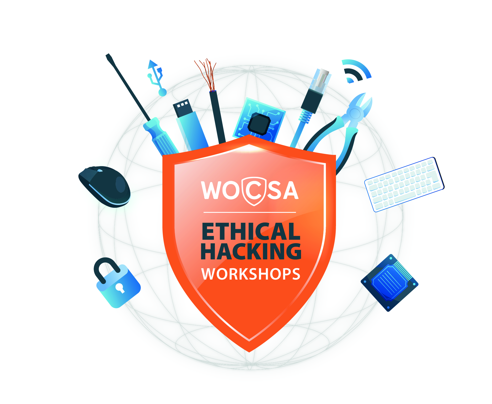

# WOCSA Ethical Hacking Workshop


## Table of Contents
- [WOCSA Ethical Hacking Workshop](#wocsa-ethical-hacking-workshop)
  - [Table of Contents](#table-of-contents)
  - [Introduction](#introduction)
    - [Workshop Overview](#workshop-overview)
    - [Introduction to the WOCSA Association](#introduction-to-the-wocsa-association)
  - [Content](#content)
  - [Add Your Content](#add-your-content)
  - [Manage sub modules](#manage-sub-modules)
    - [Install sub modules](#install-sub-modules)
    - [Update sub modules](#update-sub-modules)

## Introduction
### Workshop Overview
The primary goal of these workshops is to democratize cybersecurity knowledge by making it accessible to everyone through hands-on practice. Regardless of your skill level, these workshops are open to all to raise awareness among a wide audience about this exciting field. Whether you are a beginner or an IT expert, these workshops will enable you to gain practical knowledge and essential skills to understand the risks and defenses related to information security.

### Introduction to the [WOCSA](https://wocsa.org/) Association
Because knowledge truly becomes valuable when shared, the WOCSA Association brings together experts and laypeople, professionals, individuals, and students with one common goal: to make the digital world of tomorrow safer and fairer.

By encouraging exchanges in all forms and promoting communication about cybersecurity, the association strives to raise awareness about cyber threats as widely as possible, with the ultimate goal of empowering everyone to protect themselves better.

Through its working groups, research, workshops, and public interventions, the association values the exchange of skills, the sharing of expertise, and all the dynamics offered by its members. The results of its work are transformed into informational materials or educational resources that are then made available to all and widely distributed.

The association actively supports the dissemination of its materials and is committed to delivering the results of its work to those who need it most (free publications, conferences, awareness sessions).

Through its organization, territorial network, and the involvement of its members, it promotes proximity and the sharing of cybersecurity knowledge.

## Content
The various areas of cybersecurity covered include:
- **Wireless Network Security (Wi-Fi)**: Exploring vulnerabilities and protective measures for Wi-Fi networks, including "Man-in-the-Middle" attacks and wireless connection security techniques.
- **Malicious USB Key Security**: Studying the risks associated with the use of infected or malicious USB keys, as well as methods for detecting and preventing USB-based attacks.
- **Web Application Security**: Analyzing common vulnerabilities in web applications ([OWASP Top 10](https://owasp.org/www-project-top-ten/)), such as SQL injections, Cross-Site Scripting (XSS) attacks, and security measures to protect web applications against these attacks.
- **Digital Forensics**: Introducing digital forensic techniques used to collect and analyze electronic evidence in the context of security incidents, fraud, or data breaches.
- **Malware Security**: Studying different types of malware, such as viruses, Trojans, ransomware, as well as methods for detecting, preventing, and removing malware.
- **Cryptography**: Exploring the principles and techniques of cryptography to secure communications, data, and computer systems.
- **Operating System Security**: Analyzing vulnerabilities specific to popular operating systems like Windows, Linux, or macOS, and security practices to reduce risks.
- **Social Engineering (Phishing) and Security Awareness**: Exploring social engineering techniques used by attackers to manipulate individuals and obtain sensitive information, as well as security awareness to promote good practices among users.
- **Password Cracking**: Exploring techniques and methods used for password cracking, including brute-force attacks, dictionary attacks, and rainbow table attacks. Studying best practices for creating strong passwords and security measures to protect passwords.
- **Mobile Hacking (Android and iOS)**: Analyzing vulnerabilities specific to mobile operating systems like Android and iOS. Exploring hacking techniques used to access sensitive data, bypass security measures, and exploit mobile applications. Studying methods for protecting and securing mobile devices.

## Add Your Content
Indeed, WOCSA stands for Worldwide Open Cyber Security Association, which means our goal is to promote openness and the sharing of cybersecurity knowledge. If you would like to propose a workshop or share your ideas, we invite you to submit a merge request. We warmly welcome contributions from anyone who wishes to share their knowledge and expertise.

## Manage sub modules
### Install sub modules
```bash
git submodule update --init --recursive
```
### Update sub modules
```bash
git submodule update --recursive --remote
```